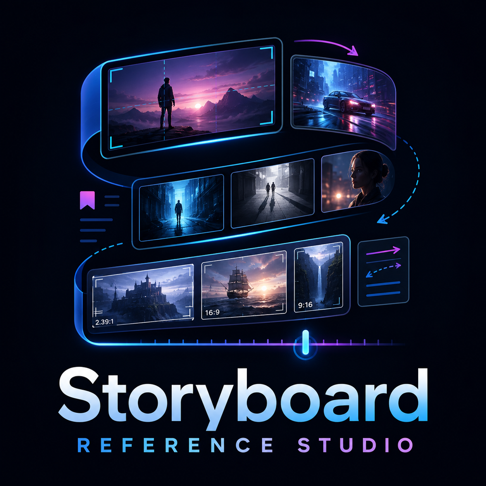
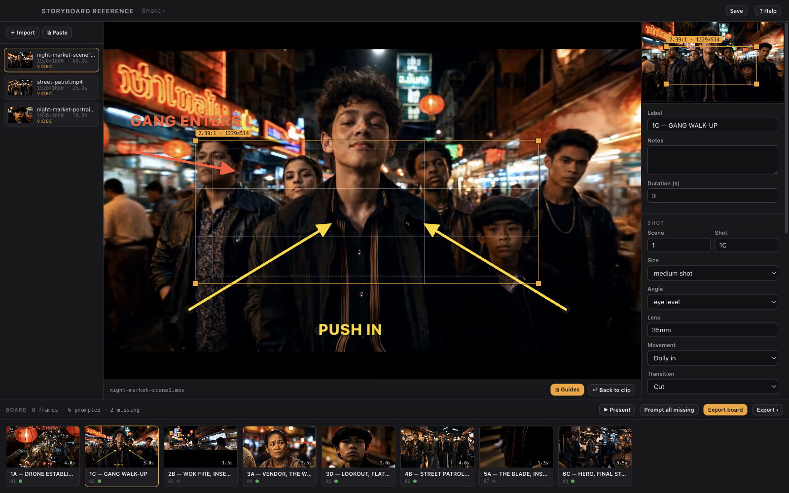
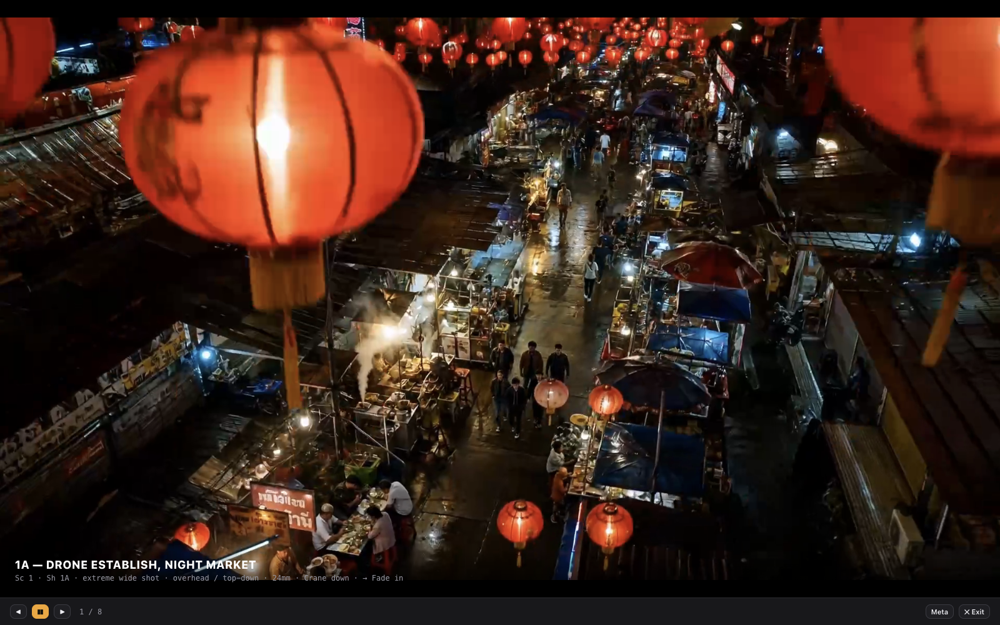

<div align="center">



<p align="center">
  <a href="LICENSE"></a>
  <a href="../../releases/latest"></a>
  
  <a href="https://ko-fi.com/samwasserman"></a>
</p>

# STORYBOARD **REFERENCE**

**Turn any reference imagery into stills + image-generator prompts — recreate any framing in your generator of choice.**


</div>

---

Image generators give you far better results when you show them exactly the framing you want. Storyboard Reference Studio is the fastest path from *"I love how this shot is composed"* to a **still + a generator-ready prompt** that recreates its shot size, angle, blocking, lighting, and mood. Drop in a movie clip, phone footage, a pulled still, or a mood image; pull the frames that matter; and export a storyboard package: full-res stills (reframed as you set) and a prompt per frame, phrased for **Midjourney, Flux, GPT-Image, Nano Banana, SDXL, or a generic target.**

It is deliberately **not** an editor. Pulling reference frames, reframing them, and writing precise per-generator prompts is the whole product. The whole app runs offline — the only thing that needs credentials is the one-click Claude-vision prompt (and there's a built-in offline template mode for that too).

- 🎞️ **Auto-board scene detection** — point it at a section and it finds the cuts, pulling one frame per shot. Or every N seconds, or N evenly-spaced frames.
- ✂️ **Reframe on the stage** — select a card to recompose it full-size with rule-of-thirds + action-safe guides and a live resolution readout; reframe to 16:9, 9:16, 1:1, 4:3, or 2.39:1, applied full-res on export.
- ↗️ **Camera-move annotations** — draw arrows and action text over a frame; they render on the board, in Present mode, and composited onto every exported still.
- 🎬 **Animatic + Present mode** — give each frame a hold time, play the board full-screen (with an optional audio scratch track), and export a **1920×1080 animatic MP4**.
- 📄 **Every deliverable** — a board package, an **animatic MP4**, a **PDF storyboard** (cover + 2×3 grid), and a **shot-list CSV** (scene, shot, size, angle, lens, movement, transition, duration).
- 🎯 **6 generator profiles** — each phrases the prompt the way its model likes it, including Midjourney's exact trailing `--ar` (from the frame's crop) and `--style raw`. No API key? An offline template builds a scaffold from the frame's metadata.
- 🤖 **Agent-drivable** — a bundled MCP server lets Claude Code, Codex, or any MCP client build, prompt, annotate, and export the board for you.

---

## The 60-second workflow

1. **IMPORT** — drag in videos and images (or paste from the clipboard). They land in a media bin.
2. **PICK** — for a video: scrub, set an in/out section with draggable handles, and bookmark individual frames — or one-click **Auto-board** the section (scene detect / every N seconds / N frames). Images import as frames directly.
3. **BOARD** — picked frames become cards on a storyboard strip: reorder by drag, label (`SHOT 1A — HERO ENTERS`), add notes, and reframe each to a target aspect with a draggable crop overlay.
4. **PROMPT & DIRECT** — one click generates a per-frame prompt via Claude vision — shot size & angle, lens feel, subjects & blocking, environment, lighting, color/mood, style keywords — phrased for your selected generator. Editable in place. Batch **Prompt all missing**. No key? Fill the offline template. Set each frame's shot metadata, hold time, and draw camera-move arrows.
5. **PRESENT & EXPORT** — press **P** to play the board as an animatic, then pick a deliverable from **Export ▾**: a board package (below), an **animatic MP4**, a **PDF storyboard**, or a **shot-list CSV**. **Export board** writes one folder and reveals it in Finder:

```
Storyboard/board-2026-07-07-…/
├── 01_shot-1a-hero-enters/
│   ├── still.png        # full-res, reframed to the crop you set
│   └── prompt.txt       # the frame's prompt (or template scaffold)
├── 02_ext-street-night/
│   ├── still.png
│   └── prompt.txt
├── …
├── prompts.json         # the whole board, machine-readable
├── contact-sheet.png    # labelled ffmpeg tile montage of every frame
└── board.md             # a readable markdown storyboard
```

---

## Screenshot tour

|  |  |
|---|---|
|  |  |
| **Pick** — scrub a clip, pull an in/out range with draggable handles, and bookmark the exact frame. Frame-step with the arrow keys, or Auto-board the whole section by scene cut. | **Reframe & direct** — recompose a frame full-size with rule-of-thirds + action-safe guides, and draw camera-move arrows and action text. Overlays show on the board and composite onto every exported still. |
|  |  |
| **Prompt** — fill the shot list (scene, shot, size, angle, lens, movement, transition), set a hold time, and prompt the frame for your target generator; edit in place or build one offline from the template. | **Present** — play the board full-screen as an animatic with a shot-metadata strip and an optional audio scratch track. Space plays, arrows step, `M` toggles the strip. |
|  |  |
| **Export** — pick a deliverable from **Export ▾**: a board package, an animatic MP4, a PDF storyboard, or a shot-list CSV. Each writes to the project's `exports/` folder and reveals it in Finder. |  |

---

## Feature tour

### Auto-board scene detection

Point Auto-board at a clip (or an in/out section) and pick a mode: **Scene detect** runs ffmpeg scene-change detection and pulls one frame per cut — sensitivity is a single slider (lower finds more cuts). **Every N seconds** and **N evenly-spaced frames** are there for footage without hard cuts. Every extracted frame lands on the board as a card with a full-res still already cached.

### Aspect reframing

Any frame can be recomposed to **16:9, 9:16, 1:1, 4:3, or 2.39:1** with a draggable crop overlay that holds the target aspect while you drag its corners. The crop is stored normalized in source space and applied **full-resolution on export** via ffmpeg — the source frame is never touched, and the aspect flows straight into the prompt (e.g. Midjourney's `--ar`).

### 6 generator profiles

Prompts are **phrased per generator**, not one-size-fits-all:

| Profile | How it phrases the prompt |
|---|---|
| **Midjourney** | Comma-separated visual phrases, subject → blocking → environment → light → lens, with a trailing `--ar <your crop>` and `--style raw`. |
| **Flux** | Fluent natural-language sentences, camera and lighting up front. |
| **GPT-Image** | One detailed, directive paragraph ("Create a … shot showing …"). |
| **Nano Banana** | A tight scene description + an explicit `Match this framing:` clause. |
| **SDXL** | Tag-style, keyword/booru ordering with quality tags, no flags. |
| **Generic** | A clean, tool-agnostic cinematic description. |

The **Midjourney `--ar` is derived from the frame's actual crop** — reframe to 2.39:1 and the prompt ends `--ar 2.39:1 --style raw`; leave it on `free` and no aspect flag is appended. Adding a profile is a single data entry in `src/shared/profiles.ts`.

### Offline mode

The whole app works with no network. The one online action — the **Generate prompt** button (Claude vision, model `claude-opus-4-8`) — degrades gracefully: with no credentials it returns a friendly message and opens the **offline template**, which builds a prompt scaffold from the frame's label, notes, crop aspect, and shot-size / angle / lighting / mood dropdowns, phrased through the same generator profile.

### Deterministic exports

**Export board** writes a self-contained folder: `NN_<label>/still.png` (reframed full-res) + `NN_<label>/prompt.txt` per frame, a machine-readable `prompts.json`, a labelled `contact-sheet.png` tile montage, and a readable `board.md`. Projects themselves are a folder — pretty-printed `project.json` + copied media + a stills cache — so they diff, branch, and reopen crash-safely (60-second autosave).

### Agent control

A bundled **MCP server** lets an AI agent build and prompt the board — import-aware `get_state`, `auto_board`, `set_crop`, `describe_frame`, and `export_board` — the same moves you'd make by hand. See [Agent control](#agent-control-mcp) below.

---

## Keyboard shortcuts

| Key | Action |
|---|---|
| `Space` | Play / pause the clip (or the animatic in Present) |
| `← / →` | Step one frame back / forward |
| `I` / `O` | Set the IN / OUT point of the section |
| `B` | Bookmark the current frame |
| `P` | Present / play the board |
| `A` | Arrow annotation tool |
| `T` | Text annotation tool |
| `G` | Toggle rule-of-thirds + action-safe guides |
| `M` | Toggle the shot strip in Present mode |
| `⌘S` | Save the project |
| `⌫` | Remove the selected annotation, or the selected card |
| `?` | Toggle the in-app help |

---

## The suite

Storyboard Reference Studio is the third app in Sam Wasserman's AI-filmmaking suite. Each does one job in the pipeline from *"I can see the shot"* to a generator-ready reference:

- **[Blockout](https://github.com/wassermanproductions/blockout)** — previs: stage a scene in grey-box 3D, choreograph the camera and cast against marks, and export a motion-reference package for video generators.
- **Motion Previs Studio** — motion reference and camera-move design for shots you're building from scratch.
- **Storyboard Reference Studio** (this app) — reference: turn *existing* imagery into stills + per-generator prompts to recreate any framing.

---

## Install (macOS)

One line — downloads the latest release and installs it, skipping the Gatekeeper "damaged app" false alarm that macOS shows for unsigned downloads:

```bash
curl -fsSL https://raw.githubusercontent.com/wassermanproductions/storyboard-reference-studio/main/install.sh | bash
```

## Install

**Download** a release DMG (macOS, Apple Silicon) from GitHub Releases, or build from source:

```bash
git clone https://github.com/wassermanproductions/storyboard-reference-studio
cd storyboard-reference-studio
npm install
npm run dev                    # development, hot reload
# or
npm run build && npm start     # production build
```

Requirements: **Node 22+**. **ffmpeg** powers extraction and export — it's bundled via `ffmpeg-static` when packaged, and falls back to a system `ffmpeg` in development (`brew install ffmpeg`).

The packaged DMG is unsigned and ships with the default Electron icon (a custom logo is coming). On first launch, right-click → Open bypasses Gatekeeper. For wider distribution, set a Developer ID `identity` and notarization in [electron-builder.yml](electron-builder.yml).

---

## Agent control (MCP)

Point **Claude Code, Codex, or any MCP client** at the bundled MCP server and it can build the board, reframe, prompt, and export — driving the running app. Register it with Claude Code in one line:

```bash
claude mcp add storyboard-reference -- node /path/to/storyboard-reference/mcp/storyboard-mcp.mjs
```

Discovery and auth are automatic — the app writes a localhost-only port + bearer token to `~/.config/storyboard-reference/control.json` on launch, and the zero-dependency bridge reads it.

| Tool | Params | Does |
|---|---|---|
| `get_state` | — | Project summary: imported media + board frames. **Call first.** |
| `add_frame` | `mediaId, timeS?, label?` | Add one board frame at a source time. |
| `auto_board` | `mediaId, startS?, endS?, mode?, threshold?/everyS?/count?` | Extract many frames (scene / interval / count) and add them all. |
| `set_label` | `frameId, label` | Rename a frame. |
| `set_crop` | `frameId, aspect?, x?, y?, w?, h?` | Reframe (normalized source coords). |
| `describe_frame` | `frameId, profileId?, context?` | Generate a Claude prompt for the target generator. |
| `extract_frame` | `frameId` | Ensure a full-res still PNG exists; return its path. |
| `export_board` | — | Export the whole board package; return the folder. |
| `set_frame_duration` | `frameId, durationS` | Set a frame's animatic hold time (0.25–30s). |
| `set_shot_meta` | `frameId, sceneNo?/shotNo?/shotSize?/cameraAngle?/lens?/movement?/transition?/durationS?` | Set shot-list metadata (any subset). |
| `add_annotation` | `frameId, kind, points, text?, color?` | Draw an arrow (tail→head) or text annotation. |
| `clear_annotations` | `frameId` | Remove all annotations from a frame. |
| `export_animatic` | `burnLabel?` | Export a 1920×1080 animatic MP4 (scratch track muxed if set). |
| `export_pdf` | — | Export a PDF storyboard. |
| `export_shotlist` | — | Export a shot-list CSV. |

---

## Scripts

| Command | What it does |
|---|---|
| `npm run dev` | Run with hot reload |
| `npm run typecheck` / `npm run lint` | Strict TS + ESLint (zero warnings) |
| `npm run smoke` | Build + full end-to-end: boots the app, runs real ffmpeg extraction (interval + scene), reframes, exports a real package, and verifies it with ffprobe |
| `npm run package` | Build a macOS DMG (`release/`) |

The README screenshots in `docs/images/` are generated, not hand-captured. After a build, run the docs spec:

```bash
npm run build
README_SHOTS=1 npx playwright test tests/e2e/readme-shots.spec.ts
```

It stages a board through the app and writes the six 1600×1000 PNGs. Point it at real footage with `README_FOOTAGE_DIR=/path/to/clips` (it looks for `night-market-scene1.mov`, `street-patrol.mp4`, and `night-market-portrait.mp4`); with the variable unset it synthesizes a stand-in clip so the spec still runs. This spec is gated behind `README_SHOTS` and never runs in the normal `npm run smoke` suite.

## Project structure

See [DESIGN.md](DESIGN.md) (product brief) and [AGENTS.md](AGENTS.md) — the single source of truth for AI agents building or modifying this app: commands, repo map, hard rules (ffmpeg packaging, main-only Claude calls, `store.mutate`), the `window.__sbr` automation surface, and common-task recipes. Pure data + logic lives in `src/shared/`, imported by both the Electron main process and the React renderer.

## Support

A few people asked if they could send tips to support my work developing open source tools. So I set up an optional way in case anyone wants to.

No pressure at all. Using the apps, sharing them, starring the repositories, and contributing code all help too. Thank you.

- [GitHub Sponsors](https://github.com/sponsors/wassermanproductions)
- [Ko-fi](https://ko-fi.com/samwasserman)

## License & credits

**Apache License 2.0** — see [LICENSE](LICENSE). Free to use, modify, fork, and build on, commercially or otherwise.

**Attribution required:** per the [NOTICE](NOTICE) file (Apache 2.0 §4(d)), any use, fork, or redistribution must retain the NOTICE file and credit **Sam Wasserman ([wassermanproductions.com](https://wassermanproductions.com))** in its documentation and about/credits surface.

Created by **Sam Wasserman** — [wassermanproductions.com](https://wassermanproductions.com) · [wasserman.ai](https://wasserman.ai).
